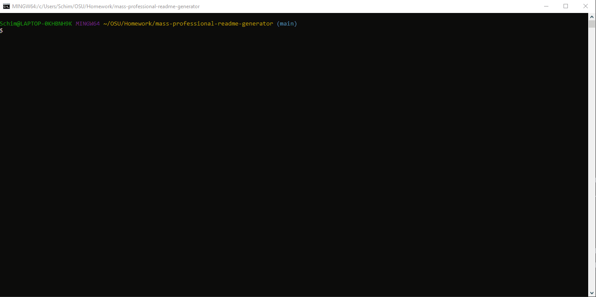

# mass-professional-readme-generator

This application will generate professional README.md file containing a Title, Description, Table of Contents, Installation, Usage, License, Contributing, Tests, and Questions. This file will be generated using the inquirer package for node.js. The user is prompted with a series of questions and the document is generated.

## Instructions

Please refer to the video located in the Media folder for a walkthrough of this application.
[Video](./Media/Instructional_Video.webm)

1. The user must download the inquirer package in the terminal by using `npm i`.
2. To initiate the application in the terminal type `node index.js`.
3. The user will be presented with a series of questions regarding the project. These will be added to the README.md file.
4. One of these questions will require the user to choose a license. This to will be added to the readme as a badge at the top of the document.
5. README.md file will be placed in the Output folder.
6. This document will need to be copied over to any project you wish to use it in as a new generation will overwrite the old file.

## Built With

* [VSCode](https://code.visualstudio.com/) - Code editing software
* [GitBash](https://gitforwindows.org/) - Command line interface
* [node.js](https://nodejs.org/en/) - Node.js® is a JavaScript runtime built on Chrome's V8 JavaScript engine.
* [inquirer](https://www.npmjs.com/package/inquirer) - Package for node.js that will prompt users with questions.

## Authors

* **Mitch Schimmoeller** - *Programmer* - [Schimmoellerm](https://github.com/Schimmoellerm)

## Acknowledgments

* The OSU coding boot camp, its Instructor and TAs who fielded questions regarding this assignment.
* My fellow classmates for providing thoughts and ideas on how to get things working how id like.
